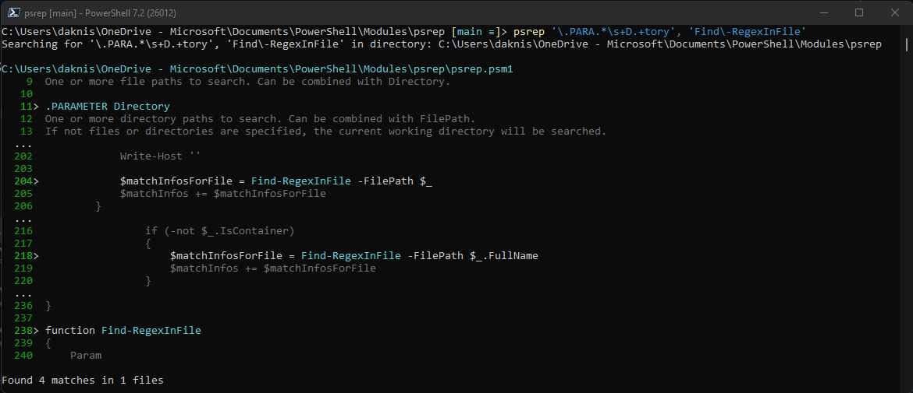

# psrep
CALISDEVELOPMENTORG CALIWESST 
A PowerShell file system searching utility.

Name and function fully inspired by grep (globally search for a regular expression and print).

## Example


## Basics

**Search for a regular expression in the current working directory:**
```console
psrep '\s*Reg.+arExpressions\*'
```

**Search a directory:**
```console
psrep 'Pattern' -Directory 'c:\repos\psrep'
```

**Search a file:**
```console
psrep 'Pattern' -FilePath 'c:\repos\psrep\psrep.psm1'
```

## Advanced

**Search for multiple patterns:**
```console
psrep 'Pattern1', 'Pattern2'
```

**Search multiple directories:**
```console
psrep 'Pattern' -Directory 'c:\repos\psrep', 'c:\temp\notes'
```

**Search multiple files:**
```console
psrep 'Pattern' -FilePath 'c:\repos\psrep\psrep.psm1', 'c:\temp\notes\psrep-notes.txt'
```

**Search directories and files (multiple of each still works):**
```console
psrep 'Pattern' -Directory 'c:\repos\psrep' -FilePath 'c:\temp\notes\psrep-notes.txt'
```

## How to install

**Option 1:** Clone the repo to a PowerShell modules folder:
```console
cd c:\users\<your username>\Documents\PowerShell\Modules
git clone https://github.com/davidknise/psrep.git
```

**PowerShellGet support coming soon.**

## Make it available on the command line

After installing, make sure you can get `psrep` when you open a PowerShell prompt.

**Option 1:** Import the module in your PowerShell profile
   1. Create a edit the file at: `c:\users\<your username>\Documents\PowerShell\Modules\profile.ps1`
   1. Add `Import-Module psrep`

**Option 2:** Import the module in your PowerShell profile
   1. Create a edit the file at: `c:\users\<your username>\Documents\PowerShell\Modules\profile.ps1`
   1. Add `Import-Module psrep`

**PowerShellGet support coming soon.**