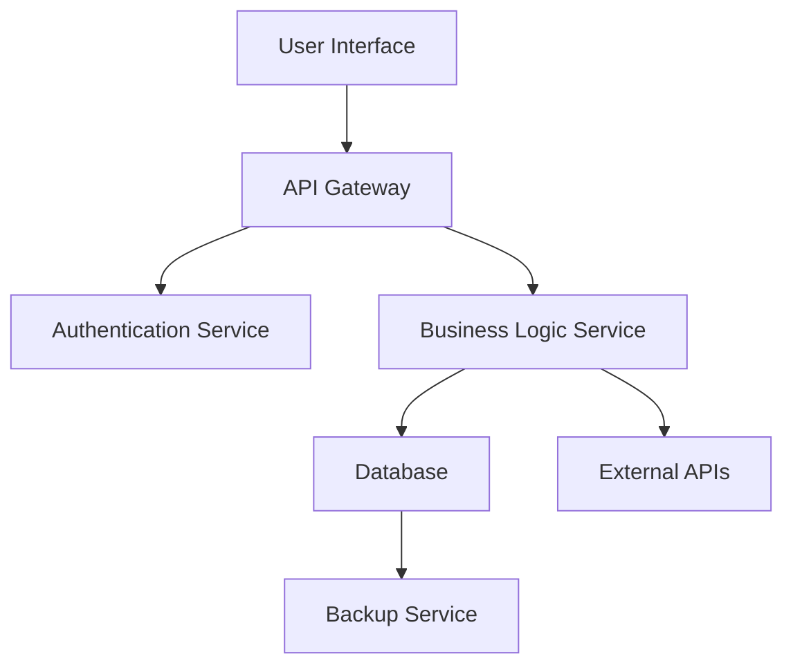

# Architecture Overview

This document provides an overview of the system architecture.

---

### Components

- **User Interface**: The front-end application where users interact with the system.
- **API Gateway**: A single entry point for all API requests.
- **Authentication Service**: Handles user authentication and authorization.
- **Business Logic Service**: Processes application-specific business rules.
- **Database**: Stores persistent application data.
- **External APIs**: Interfaces with third-party services.
- **Backup Service**: Ensures data durability and disaster recovery.
